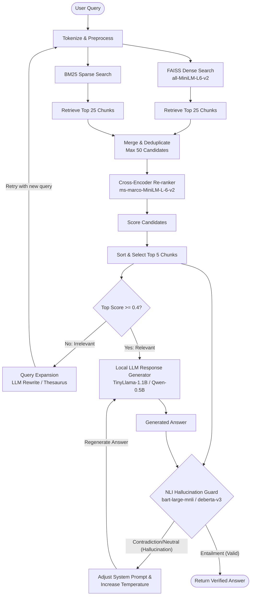

# VigilantRAG: Self-Correcting Multi-Stage RAG Engine

Standard Retrieval-Augmented Generation (RAG) pipelines suffer from **"garbage-in, garbage-out."** If the vector database retrieves irrelevant documents, the LLM hallucinates incorrect answers. 

**VigilantRAG** solves this by implementing a production-grade, self-correcting RAG pipeline that audits both its search quality and answer accuracy. It features a two-stage hybrid search, an automated query expansion loop when search results are poor, and a Natural Language Inference (NLI) "Auditor" model that blocks and regenerates responses if they contain hallucinations.

---

## 🛠️ System Architecture

The following diagram illustrates how user queries flow through the self-correcting retrieval and generation pipelines:



---

## 🌟 Key Features

* **Two-Stage Hybrid Retrieval**: Combines semantic embeddings (FAISS dense search) and keyword search (BM25 sparse search) to capture both context and specific jargon.
* **Cross-Encoder Re-ranking**: Uses a highly accurate `ms-marco-MiniLM-L-6-v2` re-ranker to score and filter candidate chunks down to the 5 most relevant.
* **Self-Correcting Retrieval Loop**: If the search quality falls below a relevance threshold (relevance score < 0.4), the engine executes **Query Expansion** (generating synonyms or rewriting the query using a local model) and searches again.
* **NLI Hallucination Guard**: Audits the LLM answer against the source documents using Natural Language Inference (`cross-encoder/nli-deberta-v3-xsmall`). If it detects contradictions or unverified facts, it blocks the output and forces the LLM to regenerate with a modified system prompt and higher temperature.
* **Premium Glassmorphic Dashboard**: A modern, responsive single-page web UI built with HTML/CSS/JS that visualizes the pipeline telemetry, search candidate details, and NLI scores in real time.
* **100% Free Cloud Deployment**: Fully Dockerized and configured to run on Hugging Face Spaces (free CPU tier with 16GB RAM).

---

## 💻 Tech Stack

* **Backend**: FastAPI, Uvicorn (async/thread pools)
* **Vector Indexing**: FAISS (Facebook AI Similarity Search)
* **Keyword Search**: Rank-BM25 (BM25Okapi)
* **Embedding & Re-ranking**: Sentence-Transformers, Hugging Face Tokenizers
* **Generative Model**: Qwen2.5-0.5B-Instruct (CPU-optimized local LLM, interchangeable with TinyLlama-1.1B)
* **Verification Model**: DeBERTa-v3-xsmall NLI (interchangeable with BART-large-mnli)
* **Frontend**: HTML5, Vanilla CSS3 (Glassmorphism, Flexbox/Grid, custom micro-animations), Vanilla JavaScript ES6
* **Containerization**: Docker

---

## 🚀 Local Quickstart

### Prerequisites
* Python 3.10+
* Git

### 1. Clone the repository and navigate inside
```bash
git clone https://github.com/your-username/VigilantRAG.git
cd VigilantRAG
```

### 2. Create a virtual environment and activate it
```bash
# Windows
python -m venv venv
venv\Scripts\activate

# macOS/Linux
python3 -m venv venv
source venv/bin/activate
```

### 3. Install dependencies
```bash
pip install -r requirements.txt
```

### 4. Run the application
```bash
python app.py
```
Open `http://localhost:8000` in your web browser.

---

## 🐳 Running with Docker

You can run the entire self-contained environment (including models) inside a Docker container:

```bash
# Build the image (this will pre-download the models into the image)
docker build -t vigilantrag .

# Run the container
docker run -p 8000:7860 vigilantrag
```
Open `http://localhost:8000` to interact with the containerized application.

---

## 🧪 Testing

To run the automated `pytest` test suite:
```bash
pytest
```
This tests chunking thresholds, FAISS/BM25 merging, query expansion fallbacks, NLI score mapping, and FastAPI CRUD endpoints.

---

## 📝 Project Directory Structure

```
VigilantRAG/
├── src/
│   ├── __init__.py
│   ├── config.py             # Global thresholds, model configurations
│   ├── retriever.py          # Chunking, FAISS and BM25 index managers
│   ├── reranker.py           # Cross-Encoder candidate scoring
│   ├── query_expansion.py    # Synonym dictionary & LLM rewrite callbacks
│   ├── hallucination_guard.py# NLI model entailment checks
│   ├── llm_client.py         # Local LLM causal generation client
│   └── engine.py             # Orchestrates the RAG loop & telemetry
├── static/                   # Dashboard Frontend
│   ├── index.html
│   ├── style.css
│   └── main.js
├── tests/                    # pytest automated suite
│   ├── __init__.py
│   ├── test_api.py
│   ├── test_retriever.py
│   ├── test_reranker.py
│   ├── test_query_expansion.py
│   └── test_hallucination_guard.py
├── app.py                    # FastAPI server entry point
├── download_models.py        # Model pre-caching utility for builds
├── requirements.txt          # Python dependencies
└── Dockerfile                # Deployment image manifest
```
